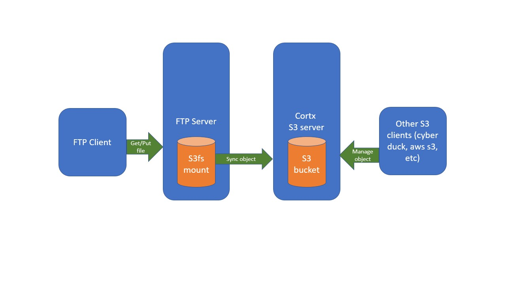

# CORTX Integration with FTP

What is FTP:
----
The File Transfer Protocol (FTP) is a standard communication protocol used for the transfer of computer files from a server to a client on a computer network. 

Integrating CORTX with FTP:
----
The integration architecture is shown below. In this integration, there is a FTP client, a FTP server, and a Cortx/S3 server. FTP client and FTP server connect through FTP protocol. FTP server uses s3fs mount as storage. s3fs sync with S3 server's S3 bucket.    

Other S3 client tools can be added to the system to manage S3 storage, or use to test the system.  

###  Setup steps (ubuntu). 
Note: Dockerfile is available to replace Step 1 and Step 2. 

Step 1: Install s3fs

    apt-get install -y s3fs

Step 2: Install ftp server

    apt-get install -y vsftpd
    sed -i 's/anonymous_enable=NO/anonymous_enable=YES/' /etc/vsftpd.conf
    mkdir /srv/ftp/cortx-fs
    chmod 600 /srv/ftp/cortx-fs
    service vsftpd start

Step 3: Mount S3 bucket with s3fs. Note: Need to setup Cortx and create S3 bucket before the following steps.

    echo ACCESS_KEY_ID:SECRET_ACCESS_KEY > /etc/passwd-s3fs
    chmod 600 /etc/passwd-s3fs
    s3fs testbucket /srv/ftp/cortx-fs/ -o passwd_file=/etc/passwd-s3fs -o url=https://192.168.1.111:443 -o use_path_request_style -o dbglevel=info -f -o curldbg -o ssl_verify_hostname=0 -o no_check_certificate -o allow_other -o complement_stat -o umask=600

###  Run and test the system 

Step 1: Add some files to the testbucket. For example, use Cyberduck or `aws s3` (need to setup separately).
    echo "test_ftp" > test_file
    aws --endpoint "https://192.168.1.111:443" --no-verify-ssl s3 cp ./test_file s3://testbucket/

Step 2: Use ftp client to connect to ftp server, list and get the test_file.

    ftp 172.17.0.2
    >cd cortx-fs
    >get test30

It's done. Now you have a ftp server ready with Cortx as the storage.
